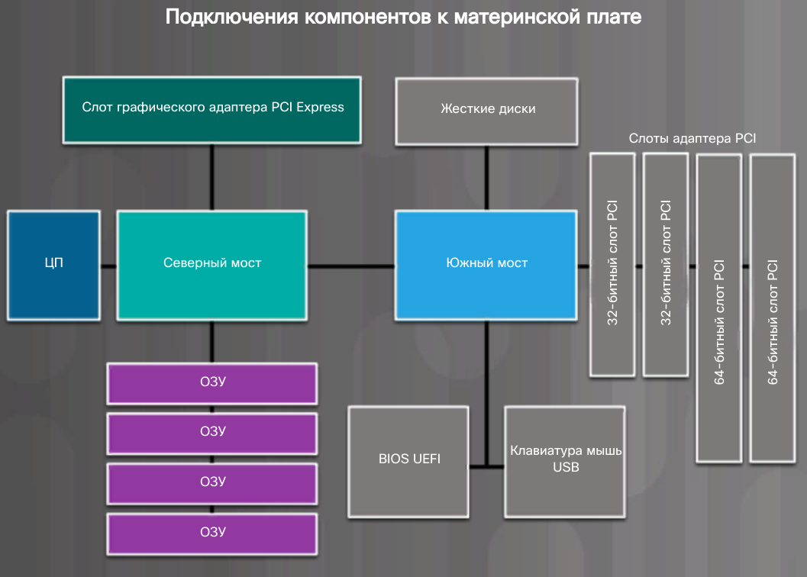

# Основы IT. Глава 1

Для повреждения компонента компьютера достаточно 30В. 
Чтобы человек почувствовал разряд достаточно 3000В.  

## Форм-фактор
Это физическая конструкция и внешний вид устройства.
* Горизонтальный корпус 
* Полноразмерный вертикальный корпус (башня)
* Компактный вертикальный корпус
* Моноблок
* Сервер

## Блок питания
Необходим для преобразования переменного электрического тока в (**AC**) в постоянный ток (**DC**) 
необходимого для работы ПК напряжения: 12В (вертушки, накопители), 5В и 3.3В (цифровые цепи).  

Блок питания может иметь **шины питания** для каждого напряжения. 
Это печатная плата, к которой присоединяются внешние кабели. 

### Форм-фактор БП
* AT – устаревший. 
* ATX – устаревший.
* ATX12V – самый распространённый форм-фактор. Выделенная цепь питания для ЦП.
* ESP12V – изначально был предназначен для серверов, теперь используется в том числе для ПК.

### Разъёмы БП
* 20/24-контактный щелевой разъём для питания материнки. 
* Несимметричный SATA – питания HDD.
* Несимметричный Molex – устаревший разъём питания HDD, CD-ROM.
* Несимметричный Berg – для Floppy.
* 4-8-контактный – вспомогательное питание элементов материнки.
* 6/8-контактный – питание PCI-устройств. 

## Материнская плата
Основа компьютера, содержит шины, соединяющие компоненты друг с другом. 

### Компоненты материнки
* CPU 
* RAM
* Слоты расширения – дополнительные компоненты, PCI
* Чипсет – интегральные микросхемы, управляющие взаимодействием системного оборудования с CPU. Определяет типы разъёмов на материнке, возможный объём RAM.
* BIOS (микросхема базовой системы ввода-вывода) – управляет загрузкой компьютера и потоком данных между HDD, GPU, устройствами ввода etc, проводит самопроверку при включении (**POST**).
* UEFI (микросхема единого расширяемого микропрограммного интерфейса) – определяет другой программный интерфейс для служб загрузки и выполнения.

### Чипсет
Подключение компонентов:

### Мосты
* Северный мост – управляет взаимодействием CPU, GPU и RAM, контролирует скорость работы CPU с доп. компонентами ПК.
* Южный мост – позволяет CPU работать с медленными внешними устройствами, слотами расширения, HDD.

### Форм-фактор материнки
* ATX – самый частотный. 30.5х24.4 см, один 20-контактный разъём питания.
* Micro-ATX – уменьшанный ATX, обратная совместимость. 24.4x24.4 см.
* Mini-ITX – маленькие устройства, ТВ-приставки, 17х17 см. Один слот PCI, малое потребление электричества.
* ITX – 21.5х19.1см. 

## CPU
### Сокет
* PGA - ножки у проца
* LGA - ножки на матери

### Кэши
Внутрений кэш CPU
* L1
* L2 - изначально был в материнке.
* L3 - изначально был в материнке.

## Типы памяти
* ПЗУ - на них хранятся команды материнки; энегронезависимость.
* RAM - энергозависимое, хранит текущие данные, с которыми происходит работа.
В первым компах RAM была вшита в мать. 

* Одноканальность - все слоты адресуются одновременно.
* Многоканальность 

### Ошибки памяти
* Без контроля чётности - самое распространённое, без ловли ошибок.
* С контролем чётности - восемь бит для данных и один бит для контроля по чётности.
* ECC - находит многобитовые, но исправляет только однобитовые ошибки. 
Используются на серверах для анализа данных и бизнес-аналитики.

### Типы ПЗУ
* ROM - устаревший формат. Записывается при изготовлении и не изменяется.
* PROM - записывается после изготовление, запись возможна лишь однажды.
* EPROM - можно перепрограммировать при помощи ультрафиолета, происходит извлечение устройства.
* EEPROM, Flash-ПЗУ - запись посредством электрического тока.

### Типы ОЗУ
* Динамическое - устаревшее, постепенно расходует энергию, периодически нужно подзаряжать.
* Статическое - быстрее, дороже динамического; малое энергопотребление, требует постоянного питания для работы. 
* SRAM (синхронное динамическое) - синхронная работа с шиной, возможность параллельной обработки перекрывающихся команд.
Считается самой быстрой, кэш ЦП. 
* DDR SDRAM - в два раза быстрее SDRAM, ниже потребление, 184 контакта и один ключ, по две IO операции за такт CPU.
* DDR2 SDRAM - выше частота, меньше шума и помех, 240 контактов, ниже потребление.
* DDR3 SDRAM - в два раза выше частота, выше пропускная способность, меньше потребление, меньше тепла.
* DDR4 SDRAM - в 4 раза выше пропускная способность, меньше потребление, выше частота, 288 контактов, коррекция ошибок ECC.
* GDDR SDRAM - графика.
  
  
### Модули памяти
* DIP - чипы для припаивания к материнке.
* SIMM - однорядный модуль памяти.
* DIMM - двухрядный модуль памяти, конфигурация DDR.
* SODIMM - маленький DIMM для ноутов. 32- и 64-битная передача данных.

## Платы адаптеров
* Звуковуха
* Видяха
* Сетевая карта
* Wi-Fi 
* Плата захвата
* ТВ-тюнер
* USB
* eSATA - доп SATA-порты через PCIe

## Слоты расширения
* PCI - устарел, 32 или 64 разряда.
* Mini-PCI - для ноутов, три типа: I, II, III.
* PCI-X - устарел, в 4 раза быстрее. Шина на 32 разряда.
* PCIe - выше пропускная способность, разновидности: x1, x4, x8, x16
* Riser card - для увеличения количества слотов расширения
* AGP - был для видях, устарел

## Порты подключения HDD
* ATA
    * Parallel (PATA)
        * IDE - 8 Мбит/с, устаревший разъём HDD
        * EIDE - 16 Мбит/с
    * Serial (SATA)
        * 1 - 1.5 Гбит/с
        * 2 - 3 Гбит/с
        * 3 - 6 Гбит/с

## Преимущества SSD
Данные хранятся в виде электрических разрядов на устройстве Flash-памяти.
SSD не имеют движущихся частей, потребляют меньше электричества, не шумят.
 
Подключаются через mSATA или M.2.

## NVMe
**Non-Volatile Memory Express** подключаются непосредственно к PCIe, не требуют спец драйверов.

## SSHD
Компромис между HDD и SDD: балванка для HDD и Flash память для кэширования. Дешевле SSD.

## Компакт-диски
* CD - аудио и видео.
* DVD - цифровое видео и данные.
* Blu-ray - цифровое видео в высоком качестве и данные.

## Видеопорты и кабели
* DVI - цифровые и аналоговые сигналы.
* VGA - аналоговый видеосигнал.
* DisplayPort - графика, домашний кинотеатр.
* HDMI - для ТВ высокой чёткости, 
* Thunderbolt 1-2 - высокоскоростное подключение периферии, HDD, RAID-массивы, сетевые интерфейсы.
* Thunderbolt 3 - тот же разъём, что и USB-C. Выше пропускная способность, может передавать видео в 4К.
* RCA - жёлтый, белый и красный кабель.

## Другие порты и кабели
* PS/2 - старые мыши и клавы
* Аудиопорты
* Сетевой порт - 8 контактов, максимальная длина Ethernet кабеля - 100м.
* SATA - 7 контактов, L-образный слот.
* IDE - старый для HDD.
* USB

## Адаптеры и конвертеры
Адаптер физически связывает две технологии, конвертер - преобразует сигнал.
* DVI-VGA
* USB-PS/2
* DVI-HDMI
* Molex-SATA
* USB->Ethernet
* HDMI->VGA

## Устройства ввода
* Клавиатура
* Мышь
* Touchscreen
* Джойстик
* KVM-переключатель - можно управлять несколькими компьютерами одной клавиатурой и мышью.
* Сканер штрих-кода
* NFC
* Вебкамера
* Фиксатор подписи
* Микрофон
* Сканер лица
* Сканер отпечатка пальца
* Распознавание голоса

## Устройства вывода
* Монитор
* Принтер
    * струйный
    * ударного типа
    * 3D
    * термографический
* Динамики
* VR
* Дополненная реальность

## Монитор
В большинстве случаев используется одна из трёх технологий: 
LCD, LED, OLED. 
* LCD - имеет два поляризационных фильтра с жидкокристаллическим раствором 
между ними. Электрический ток ставит кристаллы так, что свет может проходить 
или не проходить через них, формируя изображение.
* LED - жк дисплей, использующий светодиодную подсветку. Ярче, экономнее, легче.
* OLED - на органических светодиодах.

## Разбираем компьютер
* Отключаем его
* Отсоединяем кабель питания
* Удерживаем кнопку включение для сброса остаточного напряжения
* Отсоединяем кабели

## Термины
**Post** – Power-on Self Test – самотестирование компьютера при включении.  
**Несимметричный разъём** – нельзя подключить неправильно. Например, USB.  
**Форм-фактор** – это физическая конструкция и внешний вид устройства.  