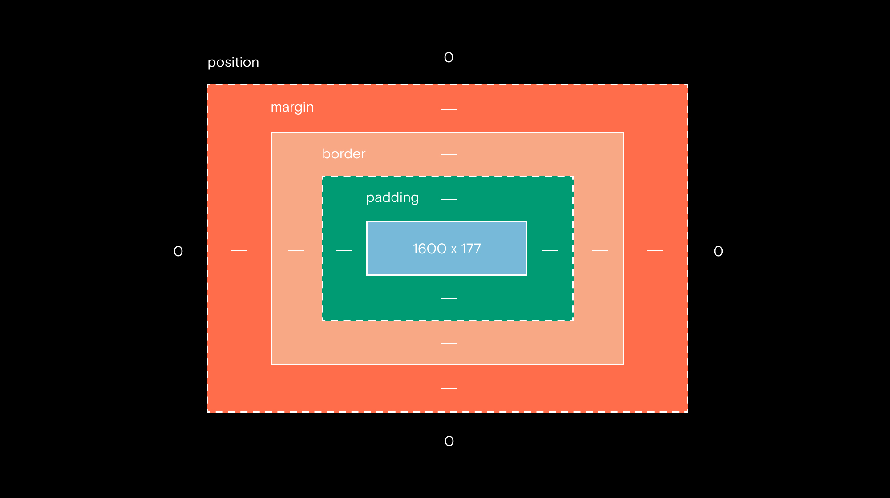

# Изучение CSS

Стиль, заданный внутри одного тега – **встроенный**, **inline**. <br /> <br />

Когда появляется необходимость параметры тега экстраполировать на 
большое их количество, то нужен CSS. Указывается в head:
```html
<style> </style>
```

```css
h1, h2 – селектор, отличительный признак выделяемого элемента. Название, #id, span#id...{
    font-size: 34px;
    background-color: red;
}
```
 
Когда стилей становится много, их выносят в отдельный `css` файл. <br /> 
Он подключается к коду в `head`:
```html
<link rel="stylesheet" href="style.css">
```

## Типы селекторов
* **Контекстный** – все `span` внутри `li`. Уровень вложенности не играет роли.
```css
li span {
    ...
}
```
* **Соседний** – для элементов, являющихся соседями по иерархии, то есть стоящих рядом
```css
em + span {
    ...
}
``` 
* **Дочерний** – все `span` внутри `li`. Уровень вложенности играет роль.
```css
li > span {
    ...
}
```
* **Псевдокласс**
Изменяет состояние тэга при некотором действии.
```css
span:hover {
    ...
}
```
1. `hover` – при наведении курсора
2. `visited` – ссылки, которые были посещены
3. `first-letter` – применить стиль к первой букве
4. `first-line` – применить стиль к первому предложению
5. `active` – по нажатии
6. `visited` – для ссылок; если пользователь переходил по ней

## Размеры
Могут задаваться через 
* `px`
* `%` от размера родительского элемента.
* `vw` – ширина относительно окна просмотра. 100 – max
* `vh` – длина относительно окна просмотра. 100 – max
* `em` – будет изменяться относительно размера окна


## Цвета
* `rgb(0, 0, 0)`
* `rgba(255, 255, 255, .5; – от 0 до 1)` – цвет и прозрачность.
* `#ffaa05` – повторяющиеся случаи можно упрощать: ffeedd -> fed; aa0000 -> a00.
* `red`


## Параметры шрифта
* `font-size: 10px` – размер шрифта в пикселях.
* `font-style` – курсив, жирный...
* `font-family` – шрифт. Comic Sans MS, Helvetica, Arial, 
* `font-color` – цвет шрифта.
* `font-weight` – толщина букавок. Можно `bold`, `normal`, а можно числами от 100 до 900.


### Шрифты
* `font-family: 'Inter', sans-serif;`
* `font-family: 'William', serif;`
```css
* {
    <!-- Если нет гельветики, то ариал, если нет и его, то стандартный системный --> 
    font-family: Helvetica, Arial, sans-serif; 
}
```


## Параметры текста
* `text-transform` – поднять регистр, опустить...
* `text-align` – где текст. 
* `text-decoration`: udnerline; – подчеркнуть текст.
* `text-decoration`: none; – сбросить форматирование. 
* `line-height` – высота букв.
* `letter-spacing` – расстояние между буквами.
* `text-indent` – отступы.


## Параметры картинки
* `width` – ширина. 
* `position`
* `top`
* `left`


## Параметры тега

* `margin-top/left/right/bottom` – внешний отступ. <i> Поля </i> между элементом и его соседями.
* `padding-top/left/right/bottom` – внутренний отступ.


## Фон
* `background-color`
* `background-image` – url(.../file.jpg). Она всегда располагается над цветом и перекрывает его.
* `background-position`
    * `center`
    * `right bottom`
    * `100px -200px`...
* `background-size` – если картинка меньше блока, то она будет повторяться. Это можно отменить через `background-repeat`.
    * `cover` – сжать или растянуть картинку с сохранением пропорций так, чтобы она занимала всю поверхность.
    * `contain` – чтобы вся картинка поместилась. Сохранит пропорции.
    * `200px 250px` – ширина и высота.
* `background-repeat`
    * `no-repeat`
    * `repeat-y` – только по у.
    * `repeat-x` – только по х.


## Трюки
* Создать полупрозрачную тёмную прослойку между изображением и текстом. 
Через `rgba` и `div`, внутрь которого помещается тек
ст.


## Классы
```css
.white-text {
    font-size: 10px;
}
```


## Короткая запись свойств
* 
```css
  padding: 20px 20px 10px 15px;
```
* Верх, по бокам, низ
```css
  margin: 10px 15px 20px;
```
* Верх и низ, по бокам
```css
  padding: 10px 20px;
```
* Со всех сторон
```css
  margin: 10px;
```


## Границы
Находятся между `margin` и `padding`.


## Border
`border-(left, right, bottom, top): 5px solid black;` <br/>
`border-radius: 10px;` – скругление краёв
* `solid` – непрерывная линия
* `dashed` – пунктирная линия
* `dotted` – из точек
* `double` –  двойная сплошная линия
* `groove` – объёмная линия
* `ridge` – выпуклая объёмная линия
* `inset` – блок выглядит так, как будто он вдавлен 
* `outset` – блок выглядит так, как будто он выпуклый


## Блоки
* `float: left;` – блоки могут располагаться в линию
* `clear: `
* `position: relative; fixed; absolute`


## Display 
* `block`
* `inline`
* `none`
* `list-item`


## Visibility
* `hidden`


## Overflow
Что делать с контентов, вылезшим за пределы блока
* `hidden` – скрыть
* `scroll` – снабдить полосами прокрутки
* `auto` – снабдить только необходимыми полосами прокрутки 

<hr/>

`max/min-height/weight/width` – позволяют задавать минимальный размер тэга. 
Он будет подстроен под количество контента. 

## Стили спика
* `list-style-position: inside/outside;` – показатели элементов показаны или скрыты
* `list-style-type: ;` – меняет типы показателей элементов


## Слои
