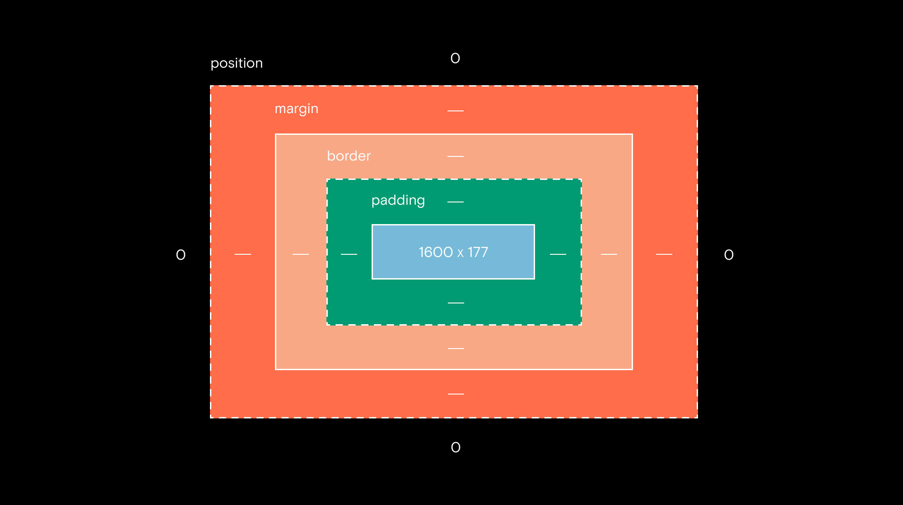
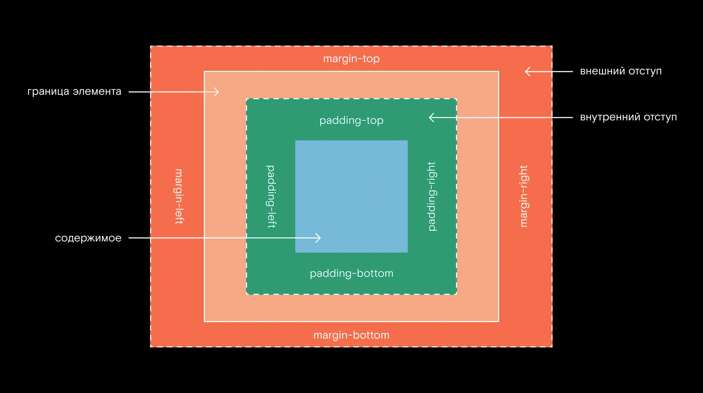

# Изучение HTML


**HTML** – разметка страницы. Первым делом в браузер загружается именно html код страницы. <br />
**CSS** – стили. <br />
**JavaScript** – функциональность на стороне клиента. <br />
**PHP** – функциональность на стороне сервера. <br />


## Тэги
* `<!DOCTYPE html>` – указание, какой HTML использовать. По умолчанию используется самый последний.
* `<html> </html>` – тело страницы, внутри весь код.
* `<head> </head>` – шапка: стили, скрипты, авторы сайта...
* `<title> </title>` – заголовок, то, что указано в браузере во вкладке.
* `<body> </body>` – тело страницы.


## Текстовые тэги
* `<p align="center"> </p>` – абзацы. `align` – где будет находится текст.
* `<h1> </h1>` – заголовки разного уровня: 1-6, выделено жирным.
* `<b> </b>` – жирный текст, использование считается **неправильным**.
* `<strong> </strong>` – жирный текст.
* `<i> </i>` – курсив, использование считается **неправильным**.
* `<em> </em>` – курсив.
* `<strike> </strike>` – перечёркнутый текст.
* `<u> </u>` – подчёркнутый текст.
* `<abbr title="Шизофренический уклад един"> ШУЕ </abbr>` – аббревиатура, при наведении курсора покажет `title`.
* `<address> </address>` – адрес, выделяет текст специфическим шрифтом и курсивом.
* `<small> </small>` – маленький текст.
* `<big> </big>` – большой текст.
* `<pre> </pre>` – сохряняет символы конца слова внутри: пробелы, \t, \n. Обычно используется для написания кода.
* `<blockquote cite="https://vk.com/id1"> </blockquote>` – цитата. `cite` – источник цитаты.
* `<q cite=""> </q>` – цитата, текст внутри обрамляется в кавычки. `cite` – источник цитаты.
* `<hr />` – горизонтальная линия.
* `<br />` – перевод на новую строку.
* `<nobr> </nobr>` – убрать переводы на новую строку.
* `<center> </center>` – центрировать текст.
* `<sub> </sub>` – текст снизу, индексы.
* `<sup> </sup>` – текст сверху, степени.


## Комментарии
\<!-- --!> 


### head
Внутри пишется `title`. указывается `meta`, где прописана кодировка сайта
```html
<!-- какая кодировка на сайте использована -->
<meta http-equiv="Content-Type" content="text/html; charset=UTF-8" /> 
<!-- отображается в поисковике под названием -->
<meta name="discription" content="" />
<!-- ключевые слова для поискового робота -->
<meta name="keywords" content="" />
<!-- подключить стили из CSS скрипта -->
<link href="" rel="stylesheet" type="text/css" /> 
<!-- подключить скрипты JavaScript -->
<script src=""> </script>  
<!-- добавить иконку вкладки -->
<link rel="icon" href="fav.ico" type="image" /> 
```

### body
Тело страницы, всё внутри него.


## Список
* Нумерованный:
```html
<ol type="I|i|1|a|A" start="с чего начинать" reversed="reversed; перевернуть порядок">
    <li> </li>
</ol>
```
* Ненумерованный:
```html
<ul type="disc|circle|square">
    <li> </li>
</ul>
``` 
* Ненумерованный с большим отступом, вышел из употребления:
```html
<dir>
    <li> </li>
</dir>
```
* Список определений:
```html
<dl>
    <dt> Пункт </dt> <dd> Определение </dd> 
</dl>
```


## Атрибуты
Вместо них лучше использовать `style=` и CSS.
Глобальные атрибуты:
* title="" – при наведении на блок будет отображён текст.


## Ссылки
* Ссылка на другую страницу:
```html
<a href="https://yandex.com" target="_blank" title="Yandex"> Yandex </a> – ссылка откроет сайт в новой вкладке.
<a href="/etc/vim/"> Vim config </a>
```
* Ссылка на блок на текущей странице:
```html
<a href="#example"> </a> – перейдёт к тэгу `a` с именем `example`
<a name="example"> </a>
```

## Картинки
```html
 
```

## Таблицы
```html
<table border="1; границы" bgcolor="цвет фона" width="ширина таблицы" bordercolor="цвет границы">
    <caption> Название таблицы </caption> 
     <tr>
        <th> Столб 1 </th> – выделено жирным 
        <th> Столб 2 </th>
        <th> Столб 3 </th> 
    </tr> 
    <tr> <td colspan="объединение строк" rowspan="объединение столбцов"> Значение 1 </td> <td> Значение 2 </td> <td> Значение 3 </td> </tr> 
    <tr> <td> Значение 4 </td> <td> Значение 5 </td> <td> Значение 6 </td> </tr> 
    <tr> <td> Значение 7 </td> <td> Значение 8 </td> <td> Значение 9 </td> </tr> 
</table>
```

## Div и span
Эти тэги бессмысленно использовать без CSS.
* `div` – блок. Несколько HTML-элементов объединяются в один общий блок с общими стилями.
Через стили задаются размеры, цвет... 
```html
<!-- Родительский элемент -->
<div>
    <!-- Дочерний элемент -->
    <h2> </h2>
</div>
```
* `span` – выделить часть текста определённым стилем 


## Отступы
Вокруг элемента образуются отступы. По умолчанию их ставит браузер.



## Form
Существует для отправки форм, для этого нужен PHP.
```html
<form name="testform" action="" method="get/post"> 
input type="text; ввод текста" value="по умолчанию заполнено этим текстом" placeholder="Search...; как в поиске, надпись на фоне" name="username" maxlength="максимальная длина" id="username; можно ссылаться по этому полю"/>

<label for="pwd"> Enter your name: </label> <input type="password" id="pwd"> 
</form>
```

## Label
* `label` при нажатии на него передаёт управление форме.


### Атрибуты form
* `name` – имя.
* `id` – на форму можно ссылаться из других участков кода.
* `action` – где форма обрабатывается. "" – на этой странице.
* `method` – из PHP.


## Input
Для form
```html
<input type="text; ввод текста" value="по умолчанию заполнено этим текстом" placeholder="Search...; как в поиске, надпись на фоне" name="username; можно ссылаться по этому" maxlength="максимальняа длина" id="username"/>
```


### Типы input
* `text` – обычный текст.
* `password` – пароль, символы не высвечиваются.
* `date` – специальное поле.
* `datetime` – выдаст ошибку при неверном вводе.
* `datetime-local` – ввод даты и времени.
* `week` – неделя и день.
* `url` – url, выдаст ошибку при неверном вводе.
* `tel` – телефон, выдаст ошибку при неверном вводе. 
* `range` – ползалка.
* `radio` – кнопки выбора. Может быть выбрано только одно (если указан id=...)
* `number` – числа, ошибка при неверном вводе. 
* `image` – отправка картинки.
* `file` – отправка файла.
* `email` – проверка наличия собаки.
* `color` – выбор цвета по палитре.
* `checkbox` – кнопки выбора, может принимать несколько вариантов.
* `submit` – кнопка, нужен value="отправить", присходит перезагрузка страницы.
* `button` – кнопка, нужен value="отправить", без перезагрузки страницы.
* `reset` – кнопка, нужен value="очистить", очистит поля ввода без перезагрузки страницы.


## Textarea
Поле вводе большого текста.
* `placeholder` – надпись на фоне. Пропадает, когда происходит ввод.
* `rows` – высота 
* `cols` – длина


## Button
`<button> Отправить </button>` – кнопка с перезагрузкой страницы.


## Select
Выбор из списка вариантов 
```html
<select size="отображается строк" multiple="multiple; выбор нескольких вариантов"> 
    <option selected="selected; по умолчанию выбран" value="shue"> Example </option> 
    <option disabled="disabled" value="передаётся при отправке данных"> </option> 
</select> 
```

## Семантические тэги HTML5
* `header` – в нём заключена шапка сайта.
* `footer` – в нём заключён низ сайта.
* `article` – статья, пост, новость...
* `aside` – боковая панель.
* `menu` – меню, элементы создаются так же, как и в списках. 
* звуковая дорожка: 
```html
<audio controls="controls; добавить плеер" autoplay="autoplay; дорожка начнёт автоматически проигрываться" loop="loop; зацикливание музыки">
<source src="../file.wav" />
</audio>
```
* видео:
```html
<video controls="controls; добавить плеер">
<source src="../file.mp4" />
</video>
```

## Details
Добавляет галочку слева от `summary`. Показывает текст по нажатии на неё.
```html
<details> 
<summary> Информация об авторе </summary> 
<p> Этим автором был Альберт Эйнштейн </p> 
</details> 
```

## Mark
Будет выделено `<mark> жёлтым шрифтом </mark>`


## Ruby
```html
<ruby> 
Слово <rt> надпись над ним </rt> 
</ruby>
```


## Progress
```hyml
<progress max="100; максимальное значение" value="25; текущее значение"> 
Загружено на <span id="value"> 25 </span>%
</progress>
```


## Output
....


## Frame
Вместо них лучше использовать CSS, поскольку он сохраняет все плюсы и избегает все минусы. <br />
Позволяют делать страницу на блоки со своими стилями etc.


## Наследование
Дочерний тэг будет иметь те же атрибуты, что и родительский. <br /> 


## Section
Поведение как у div, только помогает поисковикам лучше читать сайт.


## Классы
Как и id, делают некоторые теги уникальными. Например, могут использоваться при 
необходимости применить один и тот же стиль ко многим тегам. 

<br/>
Несколько классов задается через пробел
```html
<div class="text primary-content">
    ...
<div>

....

.text {
    font-size: 10px;
}
.primary-content {
    color: red;
}
```

## Поток и блочная модель
Порядок расположения элементов на странице – **поток**.
<br />

По умолчанию `div`, `header`, `section`, `h`, `p` занимают всю 
ширину своего родителя – **блочные элементы**.


### Модель любого блочного элемента
* указание размеров `width`, `height`
* внешние отступы, `margin`
* внутренние отступы, `padding`
* границы


